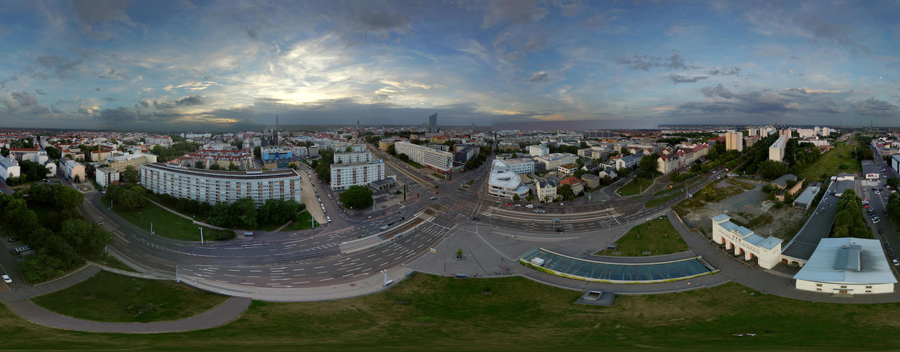

# TTN Leipzig

IoT is our passion. We love to build things and connect them to the Internet. We are a community of people who are interested in the Internet of Things and want to build a network of connected devices in Leipzig. We are a part of the global LoRaWAN network, which is a low power wide area network (LPWAN) designed to wirelessly connect battery operated “things” to the Internet in a regional, national or global network.

Our mission is to provide the entire Leipzig with Internet of Things data connectivity by crowdsourcing the network by its citizens and local companies. We are happy to have you join the community. Contact the core team and help us unleash the Internet of Things in Leipzig.

To reach even more people, TTN Leipzig is a member of TTN Mitteldeutschland network.

## What is LoRaWAN?

LoRaWAN is a Low Power Wide Area Network (LPWAN) designed to wirelessly connect battery operated “things” to the Internet in a regional, national or global network. It is an open standard developed by the LoRa Alliance, an open, non-profit association of members from leading companies in the wireless industry, with the goal of standardizing Low Power Wide Area Networks (LPWAN) for Internet of Things (IoT) applications.

## What is TTN?

The Things Network is a global community building an open and decentralized data network for the Internet of Things. It is a global open-source LoRaWAN network operated by its community of volunteers. The network is built using LoRaWAN, a media access control (MAC) protocol designed to allow low-powered devices to communicate with Internet-connected applications over long range wireless connections at low bit rates.

## What is TTN Leipzig?

TTN Leipzig is a community of people who are interested in the Internet of Things and want to build a network of connected devices in Leipzig. We are a part of the global LoRaWAN network, which is a low power wide area network (LPWAN) designed to wirelessly connect battery operated “things” to the Internet in a regional, national or global network.

## What is TTN Mitteldeutschland?

TTN Mitteldeutschland is a community of people who are interested in the Internet of Things and want to build a network of connected devices in Mitteldeutschland. We are a part of TTN Mitteldeutschland community.

## How to join?

To join the community, you need to register on [The Things Network](https://www.thethingsnetwork.org/). You can find the Leipzig community on [The Things Network Community](https://www.thethingsnetwork.org/community/leipzig/).

## Meetups

We are organizing meetups to discuss the latest developments in the Internet of Things and to share our experiences. We are happy to have you join the community: https://www.meetup.com/de-DE/lorawan-leipzig-usergroup/

---

Twitter: https://twitter.com/ttnleipzig | Meetups: https://gettogether.community/ttn-leipzig
